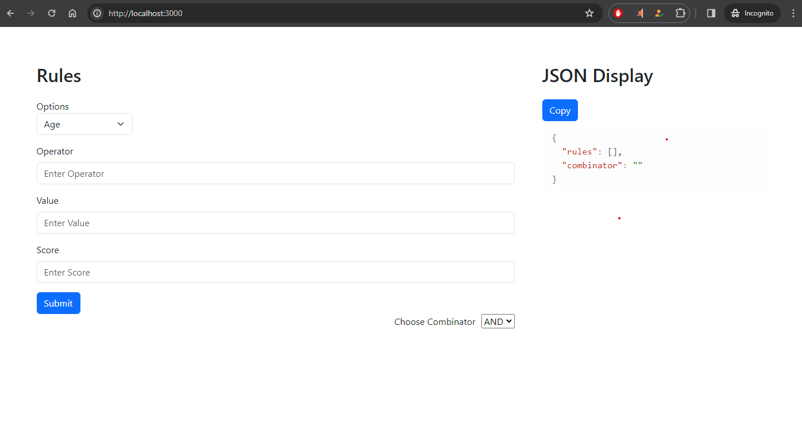

# Crego project

Screenshot:



```md
git clone https://github.com/mathew-stark/Crego_project.git
```

```md
cd react-application
```


```md
docker build -t crego_project
```

```md
docker run -p 3000:3000 -d crego_project
```

